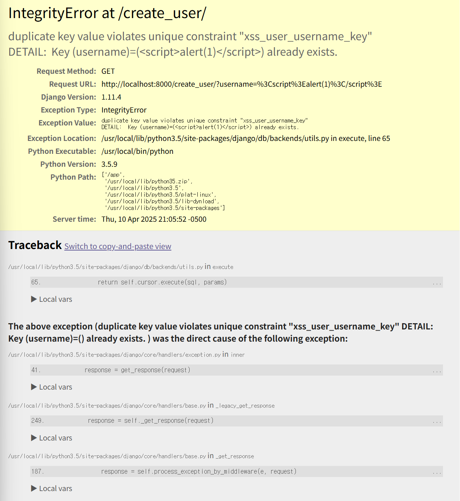
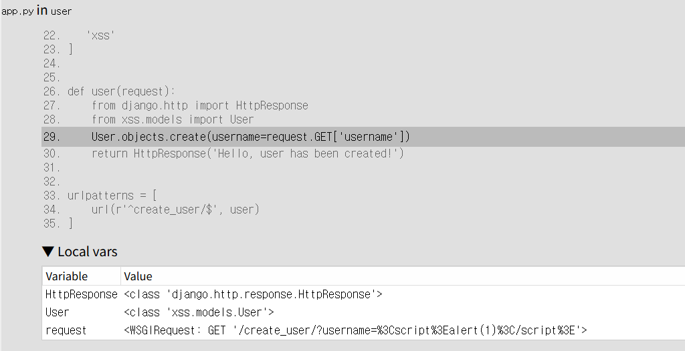

# Django 500 Debug Page Cross-Site Scripting (XSS) (CVE-2017-12794)

Django는 빠른 개발과 깔끔하고 실용적인 설계를 장려하는 고수준 Python 웹 프레임워크입니니다.

Django 1.11.15와 1.10.8 이전 버전은 디버그 에러 페이지에서 corss-ste scripting(XSS) 취약점이 있습니다.

디버그 모드가 활성화 되어 있을 때 에러 페이지는 이스케이프 되지 않은 HTML을 통해 잠재적으로 민감한 정보에 노출될 수 있습니다. 

이 취약점은 데이터베이스 오류가 발생했을 때 트리거되고고
오류 세부 정보가 디버그 페이지에 표시되는 과정에서
데이터베이스로부터 전달된 오류 메시지가 템플릿에 렌더링되기 전에 적절히 이스케이프되지 않아 발생합니다.


출처:

- <https://www.djangoproject.com/weblog/2017/sep/05/security-releases/>
- <https://nvd.nist.gov/vuln/detail/CVE-2017-12794>
- <https://www.leavesongs.com/PENETRATION/django-debug-page-xss.html>

## 환경 설정

이 명령어를 통해 Django 서버를 시작할 수 있습니다. 
(Django 버전은 1.11.4):

```
docker compose up -d
```

서버가 시작되면 `http://your-ip:8000`를 통해 Django 홈페이지에 접속할 수 있습니다.


## PoC 

다음 url에 접속해 Javascript 코드가 포함된 악의적 사용자 이름으로 사용자를 생성합니다.

```
http://your-ip:8000/create_user/?username=<script>alert(1)</script>
```


첫번째 요청은 성공합니다.


이후 동일한 URL에 다시 접속하면 데이터베이스의 고유 제약 조건으로 인해 에러가 발생합니다.
이때 에러 페이지에는 이스케이프되지 않은 사용자 이름이 그대로 노출됩니다. 





브라우저는 사용자 이름에 포함된 JavaScript 코드를 실행하게 되며, 이를 통해 XSS(크로스 사이트 스크립팅) 취약점이 발생할 수 있습니다.
이 취약점은 공격자가 디버그 페이지 내에서 임의의 JavaScript 코드를 실행하는 데 악용될 수 있으며 
이를 통해 세션 탈취 또는 기타 클라이언트 측 공격으로 이어질 수 있습니다.

이 취약점의 원리에 대한 자세한 설명은 참고 링크의 세 번째 문서를 참조하세요 : <https://www.leavesongs.com/PENETRATION/django-debug-page-xss.html>
